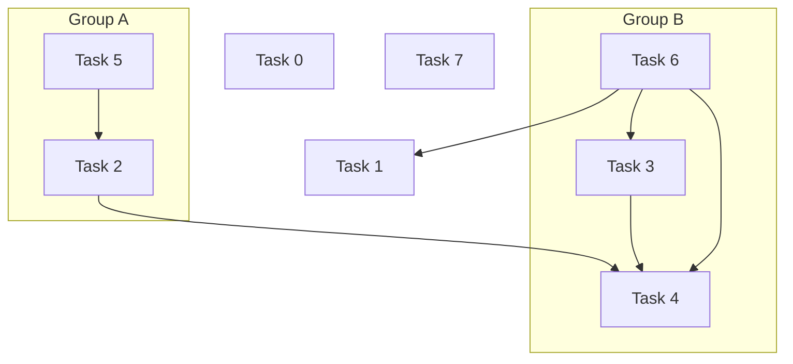

Dependent Sort
==============

Sort by dependencies and groups.

For example, the instantiation order of parsed types, or the introduction order of packages.

## Usage




```rust
#[test]
fn execution_order() {
    let mut tasks = DependentSort::default();
    tasks += Task::new(&0);
    tasks += Task::new_with_dependent(&1, vec![&6]);
    tasks += Task::new_with_dependent(&2, vec![&5]).with_group(&"A");
    tasks += Task::new_with_dependent(&3, vec![&6]).with_group(&"B");
    tasks += Task::new_with_dependent(&4, vec![&2, &3, &6]).with_group(&"B");
    tasks += Task::new_with_dependent(&5, vec![]).with_group(&"A");
    tasks += Task::new_with_dependent(&6, vec![]).with_group(&"B");
    tasks += Task::new(&7);
    let sorted = tasks.sort().unwrap();
    for task in &sorted {
        println!("{:?}", task);
    }
    let ids = sorted.into_iter().map(|task| *task.id).collect::<Vec<_>>();
    assert_eq!(ids, vec![5, 2, 0, 7, 6, 3, 4, 1])
}
```

Output the following construction sequence, and execute the same group of tasks together:

```rust
Task { id: 5, group: Some("A"), dependent_tasks: [] }
Task { id: 2, group: Some("A"), dependent_tasks: [5] }
Task { id: 0, group: None, dependent_tasks: [] }
Task { id: 7, group: None, dependent_tasks: [] }
Task { id: 6, group: Some("B"), dependent_tasks: [] }
Task { id: 3, group: Some("B"), dependent_tasks: [6] }
Task { id: 4, group: Some("B"), dependent_tasks: [2, 3, 6] }
Task { id: 1, group: None, dependent_tasks: [6] }
```

